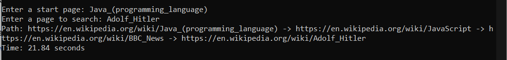

# Wikipedia Crawler

Wikipedia Crawler is a console application built with Java. This application takes a Wikipedia article as input, scans
it for other Wikipedia links, opens those links, and continues scanning until it finds the link to a target page (e.g.,
Adolf Hitler page). Additionally, it ensures that the provided URLs are valid and accessible.

## Features

- Receives a Wikipedia article URL and a target Wikipedia article URL.
- Scans for links recursively until it finds the target page.
- Validates URLs to ensure they exist and return successful responses (not 4xx or 5xx).
- Provides the path and time to the target page.

## Running the Application

To run the application, follow these steps:

### Option 1: Using Java 21

Ensure you have Java 21 installed on your system.
```
git clone https://github.com/artmkrvshn/wikipedia-recursive-crawler.git
cd wikipedia-recursive-crawler
./gradlew shadowJar
java -jar build/libs/wikipedia-crawler-1.0-SNAPSHOT-all.jar
```

### Option 2: Using Docker

Ensure you have Docker Engine running.
```
git clone https://github.com/artmkrvshn/wikipedia-recursive-crawler.git
cd wikipedia-recursive-crawler
./gradlew jibDockerBuild
docker run --name wikipedia-crawler -it --rm wikipedia-crawler:1.0-SNAPSHOT
```

Once the application is running, enter the start page and target page URLs when prompted.

## Screenshot



More screenshots in images folder

## License

This project is licensed under the MIT License - see the [LICENSE](LICENSE) file for details.
